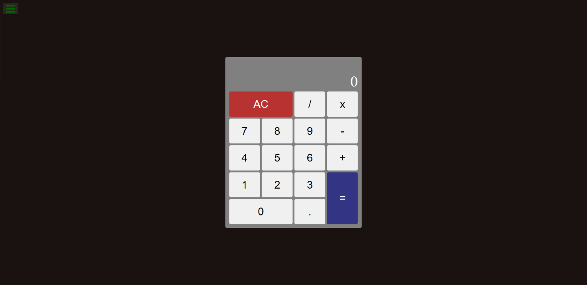

# JavaScript Calculator using React

## Table of Contents

- [About](#about)
  - [Built With](#built-with)

## About

This project focuses on building a basic calculator using React. The operations covered in this project include,
- Addition
- Subtraction
- Multiplication
- Division

Furthermore, the calculator is also capable of displaying the current input and corresponding output. Another capability that this calculator exhibits is performing calculations on existing results.

### Built With

- HTML
- CSS
- React